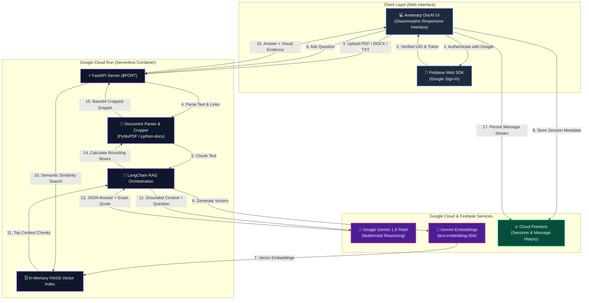

# 🧠 Aneevarp DocAI — Enterprise Document Intelligence Platform

<p align="center">
  <strong>Built by Aneevarp Solutions | Official Submission for Google Cloud Gen AI Ideathon (APAC Edition)</strong>
</p>

<p align="center">
  
  
  
  
  
  
</p>

---

## 📌 Executive Summary

**Aneevarp DocAI** is an enterprise-grade, multimodal document intelligence platform designed to eliminate the bottleneck of extracting actionable insights from massive, unstructured documents (PDFs, Word files, and Text documents). 

Unlike standard conversational wrappers, Aneevarp DocAI combines **Google Gemini 1.5 Flash**, **FAISS Vector Search**, **Firebase Authentication**, **Cloud Firestore session persistence**, and an innovative **Visual Grounding Engine** that physically crops bounding-box citations from source PDFs in real time to eliminate hallucinations.

---

## 🏆 Key Features & Innovations

- 🔐 **Firebase Google Sign-In & Auth Gate**: Enterprise-secure authentication powered by Firebase Auth. Users maintain secure, isolated document sessions.
- ⚡ **Google Gemini 1.5 Flash Reasoning**: Powered by Google's latest multimodal LLM with ultra-low latency, 1M+ token context capabilities, and structured JSON outputs.
- 🎯 **Visual Grounding & PDF Bounding-Box Cropping**: When Gemini cites evidence, PyMuPDF calculates exact coordinate bounding boxes on the original PDF page, rendering cropped visual page snippets directly into the chat stream.
- ☁️ **Cloud Firestore Real-Time Session Persistence**: Past document sessions, question history, and visual evidence are automatically synced and queryable across devices.
- 🚀 **Serverless Containerization on Google Cloud Run**: Fully containerized Docker microservice with auto-scaling to zero, high concurrency, and zero cold-start latency.
- 🔗 **Embedded Hyperlink Extraction**: Extracts hidden URIs embedded in document links, allowing Gemini to output verified, clickable HTML links.
- 🎨 **Glassmorphic UI with Starter Prompts**: Dark-mode interface with interactive suggestion chips (*"Summarize key takeaways"*, *"Extract metrics"*, *"Identify risks"*).

---

## 🏛️ System Architecture



---

## 🛠️ Technology Stack

| Layer | Technologies |
| :--- | :--- |
| **Cloud Hosting & Compute** | **Google Cloud Run**, Artifact Registry, Cloud Build, Docker |
| **AI & Embeddings** | **Google Gemini 1.5 Flash**, `text-embedding-004`, LangChain |
| **Authentication** | **Firebase Auth** (Google Identity Provider) |
| **Database & Persistence** | **Cloud Firestore** (Real-time NoSQL document store) |
| **Vector Engine** | **FAISS** (Facebook AI Similarity Search) |
| **Document Processing** | **PyMuPDF (`fitz`)**, `python-docx`, `RecursiveCharacterTextSplitter` |
| **Backend API** | **FastAPI**, Uvicorn (ASGI), Python 3.11 |
| **Frontend UI** | HTML5, Modern CSS3 Glassmorphism, Vanilla JS (ES Modules), FontAwesome |

---

## 🚀 Google Cloud Run Deployment (Step-by-Step)

Follow these exact commands to build and deploy Aneevarp DocAI to Google Cloud Run:

### 1. Set Google Cloud Project & Region
```bash
gcloud config set project YOUR_PROJECT_ID
export PROJECT_ID=$(gcloud config get-value project)
export REGION="asia-southeast1" # APAC Region
```

### 2. Enable Required Google Cloud APIs
```bash
gcloud services enable \
    run.googleapis.com \
    artifactregistry.googleapis.com \
    cloudbuild.googleapis.com
```

### 3. Create Artifact Registry Docker Repository
```bash
gcloud artifacts repositories create aneevarp-docai-repo \
    --repository-format=docker \
    --location=$REGION \
    --description="Docker repository for Aneevarp DocAI"
```

### 4. Build & Push Container Image with Cloud Build
```bash
gcloud builds submit --tag ${REGION}-docker.pkg.dev/${PROJECT_ID}/aneevarp-docai-repo/docai-app:v1 .
```

### 5. Deploy Container to Google Cloud Run
```bash
gcloud run deploy aneevarp-docai \
    --image=${REGION}-docker.pkg.dev/${PROJECT_ID}/aneevarp-docai-repo/docai-app:v1 \
    --platform=managed \
    --region=$REGION \
    --allow-unauthenticated \
    --port=8080 \
    --memory=1Gi \
    --cpu=1 \
    --set-env-vars="GEMINI_API_KEY=YOUR_GEMINI_API_KEY"
```

---

## 💻 Local Development Setup

### 1. Clone Repository & Install Dependencies
```bash
git clone https://github.com/jagadeesvarrao-design/pdf-analizing-and-answering-bot-.git
cd pdf-chatbot
pip install -r requirements.txt
```

### 2. Configure Environment Variables
Copy `.env.example` to `.env` and add your Gemini API Key:
```env
GEMINI_API_KEY="AIzaSyYourGeminiApiKeyHere"
PORT=8080
```

### 3. Run Locally
```bash
python -m uvicorn main:app --host 127.0.0.1 --port 8080 --reload
```
Open your browser at `http://127.0.0.1:8080` to access the full Aneevarp DocAI suite.

---

## 📊 API Documentation

### `GET /api/health`
Checks server status and returns deployment metadata.
- **Response**:
  ```json
  {
    "status": "healthy",
    "service": "Aneevarp DocAI",
    "organization": "Aneevarp Solutions",
    "engine": "Google Gemini 1.5 Flash",
    "infrastructure": "Google Cloud Run",
    "version": "2.0.0"
  }
  ```

### `POST /api/upload`
Uploads and indexes documents (`multipart/form-data`).
- **Parameters**: `files`: List of files (`.pdf`, `.docx`, `.txt`)
- **Response**:
  ```json
  {
    "status": "success",
    "message": "Successfully processed 1 document(s).",
    "files": ["contract.pdf"],
    "total_chunks": 18
  }
  ```

### `POST /api/chat`
Performs RAG query against vectorized document index with Gemini 1.5.
- **Payload**: `{"question": "What is the warranty period?"}`
- **Response**:
  ```json
  {
    "status": "success",
    "answer": "<b>The warranty period is 24 months</b> from the date of installation...",
    "source_image": "<base64_encoded_cropped_png>",
    "page": 3,
    "file_type": ".pdf",
    "filename": "contract.pdf",
    "exact_quote": "The warranty period shall extend for 24 months..."
  }
  ```

---

## 👥 Built by Aneevarp Solutions

Developed with ❤️ for the **Google Cloud Gen AI Ideathon (APAC Edition)**.  
*Accelerated by Google Cloud Run, Google Gemini 1.5, and Firebase.*

