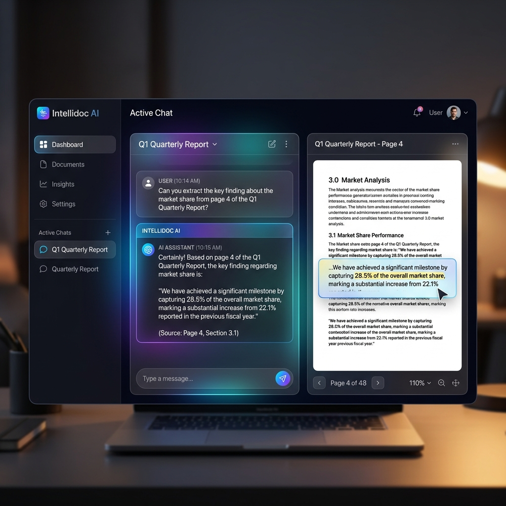
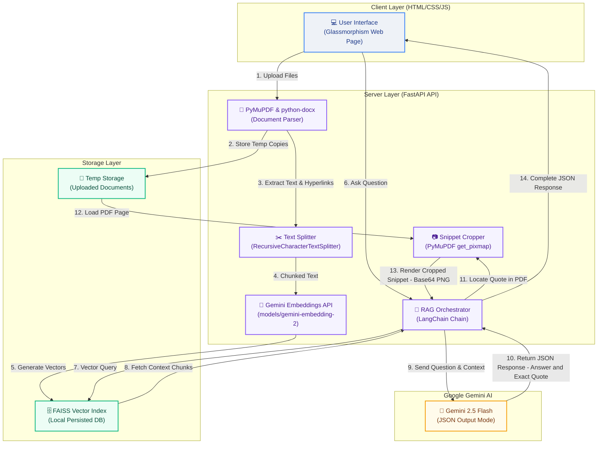

# Intellidoc: AI Document Assistant

A full-stack, AI-powered conversational assistant that allows you to upload, analyze, and chat with your documents (PDF, Word, Text). Built with FastAPI, LangChain, Google Gemini, and vanilla HTML/CSS/JS.



## 🌟 Key Features

- **Multi-Format Support**: Upload and analyze PDFs (`.pdf`), Word Documents (`.docx`), and Plain Text (`.txt`).
- **Conversational Memory & Persona**: The AI is programmed to act as a friendly, conversational assistant rather than a robotic Q&A machine, complete with rich HTML formatting and markdown integration.
- **Precise Image Cropping**: When asking questions about a PDF, the AI extracts the exact verbatim quote it used to answer you, physically scans the PDF to locate the coordinates of that text, and displays a perfectly cropped bounding-box snippet of the document alongside its answer.
- **Embedded Hyperlink Extraction**: Native text extraction often misses hidden hyperlinks. This engine uses PyMuPDF to physically extract embedded URIs from PDFs and feeds them into the AI context window, allowing the AI to generate clickable `<a>` tags in its responses.
- **Glassmorphism UI**: A gorgeous, modern, dark-mode user interface utilizing CSS backdrop-filters, micro-animations, and dynamic visual states.

## 🚀 Architecture

This application is split into two layers:
1. **Frontend**: Static HTML, CSS, and JS. Designed to be deployed on static hosting providers like Netlify or Vercel.
2. **Backend API**: A Python FastAPI server that handles document parsing, vector embedding, and LLM orchestration. Designed to be deployed on Python hosting providers like Render, Heroku, or Railway.

### Tech Stack
- **Backend Framework**: FastAPI & Uvicorn
- **AI & Orchestration**: LangChain, Google Gemini Pro 2.5 Flash, Gemini Embeddings
- **Vector Database**: FAISS (Local Persisted)
- **Document Processing**: PyMuPDF (`fitz`), `python-docx`
- **Frontend**: Vanilla JS, Vanilla CSS, FontAwesome

## 🔄 System Workflow

The following flowchart details how Intellidoc processes documents, indexes vector embeddings, handles user queries, and crops precise bounding box image snippets:



## 🛠️ Local Setup Instructions

### 1. Clone the repository
```bash
git clone https://github.com/yourusername/pdf-chatbot.git
cd pdf-chatbot
```

### 2. Setup the Python Environment
Install the required backend dependencies:
```bash
pip install -r requirements.txt
```

### 3. Add API Keys
Create a `.env` file in the root directory and add your Google Gemini API Key:
```env
GOOGLE_API_KEY="your-gemini-api-key-here"
```

### 4. Run the Backend Server
Start the FastAPI server using Uvicorn:
```bash
python -m uvicorn main:app --port 8002 --reload
```
The backend will be available at `http://127.0.0.1:8002`.

### 5. Run the Frontend
Simply open `frontend/index.html` in your web browser, or use a tool like VSCode Live Server. 
*Note: Make sure `API_URL` in `script.js` points to your active backend port (`8002`).*

## 📦 Deployment Guide

To put this website on the public internet, follow these steps:

### Backend Deployment (Render / Railway)
1. Push this repository to GitHub.
2. Create a new Web Service on [Render](https://render.com/).
3. Connect your GitHub repository.
4. Set the Build Command: `pip install -r requirements.txt`
5. Set the Start Command: `uvicorn main:app --host 0.0.0.0 --port $PORT`
6. Add your `GOOGLE_API_KEY` to the Environment Variables settings.
7. Once deployed, copy the live Render URL (e.g., `https://pdf-chatbot-backend.onrender.com`).

### Frontend Deployment (Netlify)
1. Open `frontend/script.js` and change `const API_URL = 'http://127.0.0.1:8002';` to your new live backend URL.
2. Create an account on [Netlify](https://www.netlify.com/).
3. Drag and drop the `frontend` folder directly into Netlify's manual deploy dashboard (or link it via GitHub and set the publish directory to `frontend`).
4. Your beautiful website is now live!

---
*Developed with ❤️ using AI*
